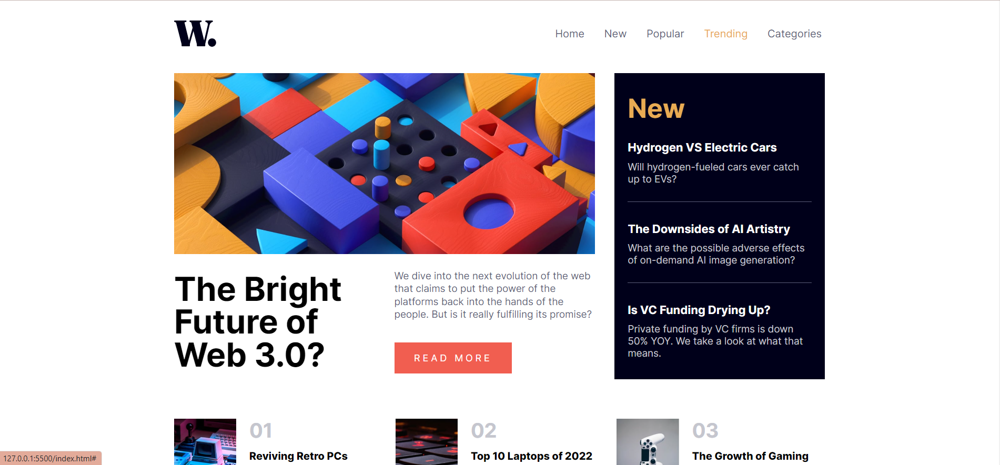
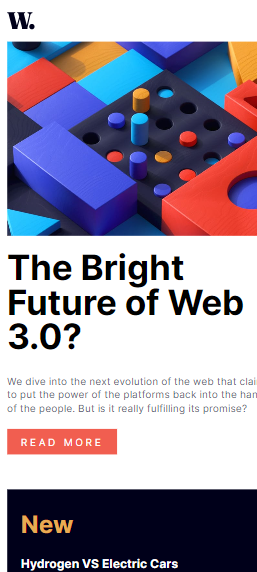
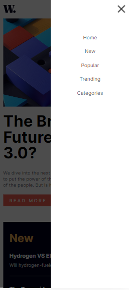

# Frontend Mentor - News homepage solution

Essa é uma solução para o [News homepage challenge do Frontend Mentor](https://www.frontendmentor.io/challenges/news-homepage-H6SWTa1MFl).

## Índice

- [Visão Geral](#Visão-Geral)
  - [O Desafio](#O-Desafio)
  - [Screenshot](#screenshot)
  - [Links](#links)
- [Meu processo](#Meu-processo)
  - [Tecnologias Utilizadas](#Tecnologias-Utilizadas)
  - [O que eu aprendi](#O-que-eu-aprendi)
- [Autor](#Autor)
- [Agradecimentos](#Agradecimentos)

## Visão Geral

### O Desafio

Os usuários devem ser capazes de:

- Ver o layout ideal da interface dependendo do tamanho da tela do dispositivo.
- Ver os estados de foco para todos os elementos interativos na página.

### Screenshot

### Links

- URL do site ao vivo: [https://viiniscript.github.io/news-homepage/](https://viiniscript.github.io/news-homepage/)

## Meu processo

### Tecnologias Utilizadas

- HTML semântico
- CSS
- Flexbox
- Javascript

### O que eu aprendi

Pratiquei a construção de um menu mobile com a animação dele abrindo da direita para a esquerda.

Aprendi:
- Fazer um efeito de segundo plano para quando o menu fosse aberto;
- Transforar um menu hambúrguer em um "X", quando clicado;
- Fazer com que não fosse possível scrollar com o menu aberto. Isso possibilitava scrollar o site arrastando o dedo pelo o menu mobile.

## Autor

- Website - [Vinicius](https://github.com/viiniScript)

## Agradecimentos

Layout e problema dispolibilizados gratuitamente pelo frontendmentor.